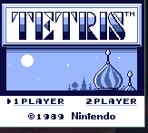
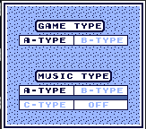
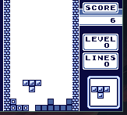
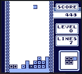
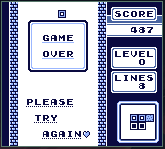

# GB-Oxide

GB-Oxide is a Game Boy/DMG emulator created using Rust. Currently supports CPU emulation and basic PPU emulation. The current color palette uses shades of blue instead of the original shades of gray. Currently able to play Tetris with minor graphical glitches. 

## Compilation and Gameplay
Clone the repo, then run `cargo run` to run the emulator. Currently there is no nice interface to change the rom. Simply redirect the path in `main.rs` to the path to your ROM. 

The controls are mapped as follows:

- Keyboard Z -> Game Boy A
- Keyboard X -> Game Boy B
- Keyboard A -> Game Boy Start
- Keyboard S -> Game Boy Select

The directions are mapped to the arrow keys.

## TODOs:
- Fix graphical glitches
- Audio
- Get more complex games to work
  - Memory bank support
  - SRAM emulation and support for saves
- Pass [Blargg's suite of tests](https://github.com/retrio/gb-test-roms)

Screenshots:

  
  
