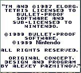
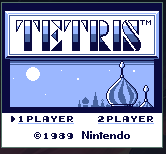

# GB-Oxide

GB-Oxide is a Game Boy/DMG emulator created using Rust. Currently supports CPU emulation and basic PPU emulation. The current color palette uses shades of blue instead of the original shades of gray. Joypad emulation in the works. 

Screenshots:

<figure>
  
  
</figure>
